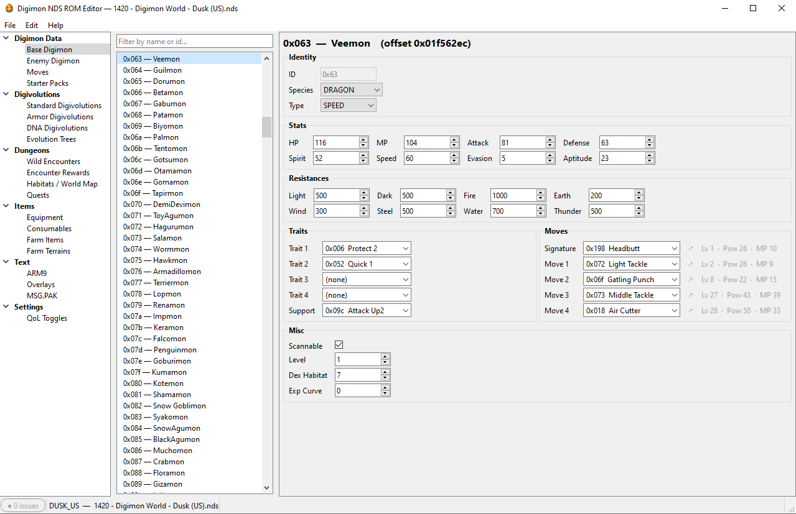

# Digimon NDS ROM Editor

ROM editor for the games **Digimon World: Dawn** and **Digimon World: Dusk**.

The information presented in these pages refers to the USA roms (serial codes NTR-A6RE-USA and NTR-A3VE-USA for Dusk and Dawn respectively).

## Contents
- [How To Use](#how-to-use)
    - [Windows](#windows)
    - [MacOS](#macos)
    - [Linux](#linux)
- [Features](#features)
- [Known Issues](#known-issues)
- [Contact](#contact)
- [Acknowledgements](#acknowledgements)
- [Support](#support)
- [Copyright Notice](#copyright-notice)

## How To Use

### Windows

1. Download the [latest release](https://github.com/joaomlsantos/DigimonNDSRomEditor/releases/latest) of the Digimon NDS ROM Editor (`DigimonNDSRomEditor_windows.zip`).
2. Unpack the downloaded files and launch `DigimonNDSRomEditor.exe`.
3. Click `File -> Open ROM…` and open a valid .nds ROM of your game.
4. Edit the ROM's data however you want. When done, click `File -> Save` to overwrite the loaded ROM, or `File -> Save As…` to write a new .nds file.

### MacOS

1. Download the [latest release](https://github.com/joaomlsantos/DigimonNDSRomEditor/releases/latest) of the Digimon NDS ROM Editor (`DigimonNDSRomEditor_macOS.zip`).
2. Launch `DigimonNDSRomEditor.app`. If your system alerts `Apple could not verify "DigimonNDSRomEditor" is free of malware that could harm your Mac or compromise your privacy`, close the warning, go to `Settings -> Privacy & Security`, scroll down to `"DigimonNDSRomEditor" was blocked to protect your Mac`, and click `Open Anyway`.
3. Click `File -> Open ROM…` and open a valid .nds ROM of your game.
4. Edit the ROM's data however you want. When done, click `File -> Save` to overwrite the loaded ROM, or `File -> Save As…` to write a new .nds file.

### Linux

1. Download the [latest release](https://github.com/joaomlsantos/DigimonNDSRomEditor/releases/latest) of the Digimon NDS ROM Editor (`DigimonNDSRomEditor-linux.tar.gz`).
2. Extract the archive by running `tar -xzvf DigimonNDSRomEditor-linux.tar.gz`.
3. Open a terminal in the extracted folder and make sure the binary is executable by running `chmod +x DigimonNDSRomEditor`, then run the application: `./DigimonNDSRomEditor`.
4. Click `File -> Open ROM…` and open a valid .nds ROM of your game.
5. Edit the ROM's data however you want. When done, click `File -> Save` to overwrite the loaded ROM, or `File -> Save As…` to write a new .nds file.

## Features

The following data is currently editable:

**Digimon Data**
- Base Digimon: species, stat type, base stats, resistances, element affinity (STAB), traits, movesets
- Enemy Digimon: base data for wild digimon and fixed digimon encounters, sprite/name reskins for fixed enemies and bosses, exp yields
- Moves: element type, effects, power, targets
- Starter Packs

**Digivolutions**
- Standard Digivolutions: digivolutions + degeneration, and their corresponding conditions
- Armor Digivolutions
- DNA Digivolutions

PS: This section also includes a view-only Evolution Trees feature, which shows the full digivolution trees of the ROM

**Dungeons**
- Wild Encounters (encountered digimon, rewards, encounter rates)
- Encounter Rewards (item/money drops)
- Habitats / World Map (visual info)
- Quests (rewards, requirements, quest flags)

**Items**
- Equipment (requirements, cost, effects)
- Consumables (cost, effects)
- Farm Items (rank, cost)
- Farm Terrains (digimon limit, species EXP)

**Text**
- ARM9 strings
- Overlay strings
- MSG.PAK strings

**Tools**
- Damage Calculator (battle damage ranges for an attacker/move/defender, ported from the reverse-engineered battle formula)

**QoL Toggles**
- Increase text speed
- Set player movement speed
- Improve battle performance
- Set base scan rate
- Unlock version-exclusive areas
- Expand player name length (from 5 to 7 characters)

## Known Issues

- When editing text, the text string must not exceed its original length. The editor currently flags any string that goes over and blocks saving until it is shortened to the original length.
- Certain sprite labels for enemy digimon are not yet identified (Grimmon, WaruSeadramon, ...).
- Consumable effect labels are not yet identified.
- Certain fields are unidentified and hidden by default. To enable editing unidentified fields, toggle `Edit -> Show unknown fields`.
- Some antiviruses may flag the executable as unrecognized, as it does not have a signed publisher. This is expected behavior; proceed by clicking "Run anyway" to open the editor.
- The player name length expansion patch is meant for new-game roms. Loading an existing base-game save into a patched rom may cause visual issues.

## Contact

For bug reports, questions or suggestions, please reach out via [Issues](https://github.com/joaomlsantos/DigimonNDSRomEditor/issues), by email ([joao.l.santos@tecnico.ulisboa.pt](mailto:joao.l.santos@tecnico.ulisboa.pt)) or through twitter ([@ProjectHawke](https://twitter.com/ProjectHawke)).

## Acknowledgements

Most of the research work for this game was accomplished using [HxD](https://mh-nexus.de/en/hxd/), [DeSmuME](https://desmume.org/) and [Ghidra](https://ghidra-sre.org/).

This editor builds on the model, constants and loader work originally developed for [DWDDRandomizer](https://github.com/joaomlsantos/DWDDRandomizer); the QoL byte-patches in particular are ported directly from the randomizer's QoL script.

Special thanks to:

- [@PocketRotom](https://github.com/PocketRotom), who's been tirelessly helping me with every macOS release [:
- [@Dreaker](https://github.com/Dreaker75), who composed a set of thorough [code notes](https://retroachievements.org/codenotes.php?g=16152) for these games and has been supporting this project's efforts through brainstorming, feature testing and listening to me yap about ROM editing for hours [:
- [@GrowaSowa](https://gamebanana.com/members/2851165), who's made several contributions deciphering previously unknown ROM data and functions [:
- [@HansyRod](https://github.com/HansyRod), who tested the app, provided very useful polishing feedback, and guided me throughout various design decisions (check out his [RVGL Randomizer](https://github.com/HansyRod/rvgl-randomizer)!) [:
- Everyone who's supported both this project and [DWDDRandomizer](https://github.com/joaomlsantos/DWDDRandomizer) <3

## Support

Digimon NDS ROM Editor and the resources behind it are the result of countless hours of work and a deep passion for the Digimon series. If you've enjoyed using the tool or simply want to support my efforts, consider contributing on Ko-fi.

Your support helps me continue working on projects like this, improving the tools, and sharing insights with the community. Thank you!

## Copyright Notice

Digimon World: Dawn/Dusk are owned by Bandai Namco Entertainment. I do not own, nor do I claim any rights to, the original game assets, code, or intellectual property associated with Digimon World Dawn and Digimon World Dusk.

This repository and the tools within are provided for educational and personal use only. They are not intended for commercial use, nor for redistribution of copyrighted game assets.
